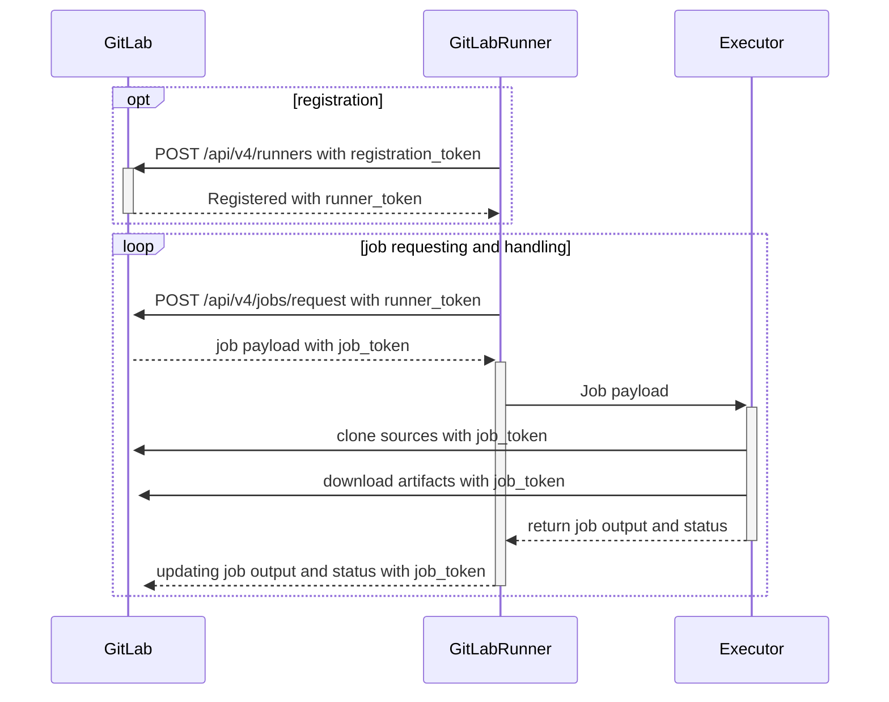

# Code-keeper

```mermaid
sequenceDiagram
    participant GitLab
    participant GitLabRunner
    participant Executor

    opt registration
      GitLabRunner ->>+ GitLab: POST /api/v4/runners with registration_token
      GitLab -->>- GitLabRunner: Registered with runner_token
    end

    loop job requesting and handling
      GitLabRunner ->>+ GitLab: POST /api/v4/jobs/request with runner_token
      GitLab -->>+ GitLabRunner: job payload with job_token
      GitLabRunner ->>+ Executor: Job payload
      Executor ->>+ GitLab: clone sources with job_token
      Executor ->>+ GitLab: download artifacts with job_token
      Executor -->>- GitLabRunner: return job output and status
      GitLabRunner -->>- GitLab: updating job output and status with job_token
    end
```
sonar-scanner