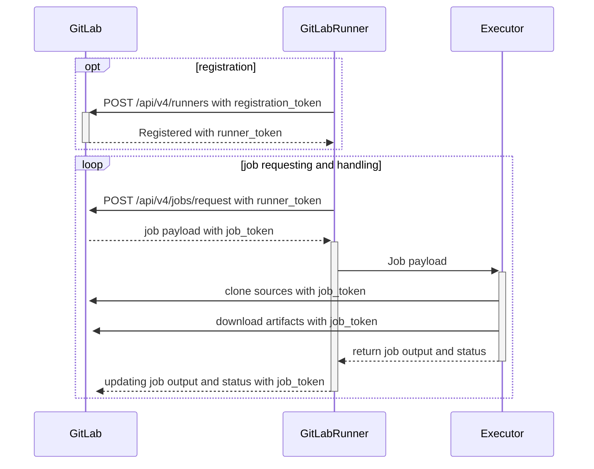

# Code-Keeper

A complete CI/CD pipeline for a microservices application — from a self-hosted
GitLab instance provisioned with Ansible, to Terraform/Terragrunt-managed AWS
infrastructure, to fully automated build → test → scan → deploy pipelines for
staging and production.



## Table of Contents

- [Code-Keeper](#code-keeper)
  - [Table of Contents](#table-of-contents)
  - [Architecture](#architecture)
  - [Repository Layout](#repository-layout)
  - [Prerequisites](#prerequisites)
  - [1. Deploying GitLab with Ansible](#1-deploying-gitlab-with-ansible)
  - [2. Provisioning Infrastructure with Terraform/Terragrunt](#2-provisioning-infrastructure-with-terraformterragrunt)
  - [3. CI Pipeline](#3-ci-pipeline)
  - [4. CD Pipeline](#4-cd-pipeline)
  - [Security](#security)

## Architecture

Three microservices, each in its own repository, deployed as independent ECS
services behind a shared Application Load Balancer:

| Service         | Role                                                         |
| --------------- | ------------------------------------------------------------ |
| `api-gateway`   | Entry point; forwards requests to inventory/billing services |
| `inventory-app` | Owns the inventory database                                  |
| `billing-app`   | Owns the billing database; consumes messages from RabbitMQ   |

Supporting infrastructure (RabbitMQ, inventory-db, billing-db) is provisioned
as part of `code-keeper-infra` and shared by both environments.

```
                        ┌────────────────┐
   Client ──────────────▶   ALB (HTTPS)   │
                        └────────┬────────┘
                                 │
                        ┌────────▼────────┐
                        │   api-gateway   │
                        └────┬───────┬────┘
                             │       │
                   ┌─────────▼─┐   ┌─▼──────────┐
                   │inventory  │   │  billing   │
                   │  -app     │   │  -app      │◀── RabbitMQ
                   └─────┬─────┘   └─────┬──────┘
                         │               │
                   ┌─────▼─────┐   ┌─────▼──────┐
                   │inventory  │   │  billing   │
                   │   -db     │   │   -db      │
                   └───────────┘   └────────────┘
```

Everything above is provisioned twice — once for **staging**, once for
**production** — with identical topology, sized and isolated independently
via Terragrunt.

## Repository Layout

This repository ties the four project repos together as **git submodules**:

```
code-keeper/
├── ansible/                  # GitLab + Runner deployment
│   ├── site.yml
│   └── roles/
│       ├── common/
│       ├── docker/
│       ├── gitlab/
│       ├── gitlab-runner/
│       └── sonar-scanner/
├── Vagrantfile                # local VM for testing the Ansible playbook
├── Makefile                   # shortcuts for vagrant + ansible commands
└── repositories/              # git submodules
    ├── code-keeper-infra/     # Terraform/Terragrunt IaC (own pipeline)
    ├── api-gateway/           # own repo, own CI/CD pipeline
    ├── inventory-app/         # own repo, own CI/CD pipeline
    └── billing-app/           # own repo, own CI/CD pipeline
```

Each service repository and the infra repository has its own
`.gitlab-ci.yml` and is triggered independently.

## Prerequisites

- GitLab account/instance with the ability to register runners
- Ansible ≥ 2.14, Vagrant + VirtualBox (for local GitLab deployment/testing)
- Terraform ≥ 1.15, Terragrunt
- Docker
- AWS account with programmatic access (staging + production credentials)
- A Docker Hub account/organization for image storage

## 1. Deploying GitLab with Ansible

`ansible/site.yml` installs and configures a self-hosted GitLab instance plus
its Runners, fully automated:

```yaml
- name: Deploy GitLab
  hosts: gitlab-server
  become: true
  roles:
    - common          # base packages, users, firewall rules
    - docker           # container runtime for Runner executors
    - gitlab            # GitLab CE install + initial configuration
    - gitlab-runner       # registers Runners against the instance
    - sonar-scanner         # SonarQube scanner used by app CI pipelines
```

**Local testing (via Vagrant):**

```bash
make up          # vagrant up — boots the VM and runs the playbook
make status       # check VM status
make ssh            # ssh into the VM
```

**Direct deployment against real hosts:**

```bash
cd ansible
ansible-playbook site.yml                      # deploy
```

Secrets used by the `gitlab` role (root password, SMTP credentials, etc.) are
kept in an Ansible Vault, never committed in plaintext:

```bash
make vault-encrypt   # cd ansible && ansible-vault encrypt roles/gitlab/vars/vault.yml
make vault-decrypt   # cd ansible && ansible-vault decrypt roles/gitlab/vars/vault.yml
```

**Verifying the deployment:**

```bash
ansible-playbook site.yml --list-tasks
systemctl status gitlab-runsvdir      # on the GitLab host
gitlab-runner verify                   # on the Runner host
```

## 2. Provisioning Infrastructure with Terraform/Terragrunt

All infrastructure lives in `code-keeper-infra`, structured with Terragrunt
so staging and production stay in sync while remaining fully isolated:

```
code-keeper-infra/
├── modules/aws/           # reusable Terraform modules
│   ├── vpc/  alb/  ecs/  ecs_task/  ecs_db_instance/
│   ├── iam/  security_group/  secrets/  acm/  cognito/  dashboard/  ebs/
├── shared/                # resources shared by both envs (e.g. ACM cert)
├── staging/
│   ├── foundation/          # VPC, IAM, ALB, security groups
│   └── workload/              # ECS cluster, services, RabbitMQ, databases
├── production/
│   ├── foundation/
│   └── workload/
├── foundation-source/     # actual module composition (foundation layer)
└── workload-source/         # actual module composition (workload layer)
```

The **infra pipeline** (`repositories/code-keeper-infra/.gitlab-ci.yml`) runs:

| Stage              | What it does                                                                  |
| ------------------ | ----------------------------------------------------------------------------- |
| `init`             | `terragrunt run --all init` — configures the remote backend & providers       |
| `validate`         | `terragrunt run --all validate` — checks syntax/config correctness            |
| `plan`             | Produces a Terraform plan artifact for both `foundation` and `workload`       |
| `apply_staging`    | Applies the plan to staging — **manual**, protected branches only             |
| `apply_production` | Applies to production — **manual**, requires `apply_staging` to succeed first |
| `destroy`          | Manual, `allow_failure: true` teardown for staging/production                 |

Each apply job uses a GitLab `resource_group` (`terraform-staging` /
`terraform-production`) to prevent concurrent applies from racing on the same
state.

## 3. CI Pipeline

Each of the three application repositories runs the same CI shape on every
push/MR, restricted to protected branches:

| Stage                    | What it does                                                        |
| ------------------------ | ------------------------------------------------------------------- |
| `build`                  | Installs dependencies and compiles/packages the application         |
| `test`                   | Runs unit and integration tests                                     |
| `scan`                   | Static analysis via SonarQube + dependency/image scanning via Trivy |
| `package (containerize)` | Builds the Docker image, tags it, pushes to Docker Hub              |

## 4. CD Pipeline

CD picks up where CI leaves off, deploying the freshly-built image to ECS:

| Stage               | What it does                                                                                                                                               |
| ------------------- | ---------------------------------------------------------------------------------------------------------------------------------------------------------- |
| `deploy_staging`    | Reads the current live ECS task definition, patches in the new image tag, registers a new revision, updates the staging service, waits for it to stabilize |
| `approval`          | Manual gate — a human confirms staging looks good before production is touched                                                                             |
| `deploy_production` | Same deploy steps as staging, targeted at the production cluster/service                                                                                   |

Deploys are **zero-downtime**: each ECS service is configured with
`deployment_minimum_healthy_percent = 100` / `deployment_maximum_percent = 200`,
so new tasks are started and pass health checks *before* old tasks are
stopped. During a rollout, both old and new task versions briefly serve
traffic side by side behind the ALB until the new version is confirmed
healthy.

## Security

- **Protected branches only** — every job in every pipeline (infra, CI, CD)
  is gated with `rules: - if: "$CI_COMMIT_REF_PROTECTED"`, so pipelines
  cannot be triggered from arbitrary branches or forks.
- **No credentials in code** — `.env` files are git-ignored; runtime secrets
  (DB passwords, RabbitMQ credentials) are pulled from AWS Secrets Manager,
  and GitLab-side secrets (SSH keys, cloud credentials, registry tokens) live
  in masked/protected CI/CD variables. Ansible secrets are encrypted with
  Ansible Vault.
- **Least privilege** — separate AWS credentials are scoped per environment
  (staging vs. production) so a staging deploy job cannot touch production
  resources, and IAM roles for ECS tasks are scoped to only what each service
  needs.
- **Manual approval gates** — both the infra pipeline and the CD pipeline
  require a human to explicitly approve the production step; nothing reaches
  production without it.
